# High-Level Architecture Diagram

```mermaid
graph TB
    subgraph "UI Layer"
        Chainlit["🖥️ Chainlit UI<br/>usecase_ui.py"]
    end

    subgraph "BRO Use Case Layer"
        BroTools["🛠️ BRO Tools<br/>bro_tools.py"]
        BroServices["📦 Services<br/>document_store<br/>markdown_exporter"]
        BroModels["📊 Models<br/>document, status"]
        BroConfig["⚙️ Settings<br/>config.py"]
    end

    subgraph "Generic Agent Framework"
        BaseAgent["🤖 Base Agent<br/>base_agent.py"]
        Middleware["🔄 Middleware<br/>injection, summarization"]
        AgentMeta["📋 Agent Config<br/>agent_meta.py"]
        ToolRegistry["🔌 Tool Registry<br/>tool_registry.py"]

        StateTools["📍 State Tools<br/>handoff, file I/O"]
        FormatTools["🔀 Format Tools<br/>convert_format"]
        LLM["🧠 LLM Factory<br/>Gemini 2.0"]
    end

    subgraph "Observability & Utilities"
        Tracing["📡 Langfuse Tracing<br/>tracing.py"]
        UIUtils["🎨 UI Utils<br/>streaming, markdown"]
    end

    subgraph "External Services"
        Gemini["Google Gemini API"]
        Langfuse["Langfuse Analytics"]
        FileSystem["File System<br/>vision-docs/"]
    end

    Chainlit -->|invokes| BaseAgent
    Chainlit -->|registers| BroTools
    Chainlit -->|streams via| UIUtils
    Chainlit -->|initializes| Tracing

    BaseAgent -->|uses| Middleware
    BaseAgent -->|uses| ToolRegistry
    BaseAgent -->|uses| LLM

    Middleware -->|reads config from| AgentMeta
    AgentMeta -->|resolves tools from| ToolRegistry

    ToolRegistry -->|contains| StateTools
    ToolRegistry -->|contains| FormatTools
    ToolRegistry -->|contains| BroTools

    BroTools -->|uses| BroServices
    BroTools -->|uses| StateTools
    BroServices -->|manages| BroModels

    LLM -->|calls| Gemini
    Tracing -->|sends to| Langfuse

    BroServices -->|reads/writes| FileSystem
```

## Key Points

- **UI Layer**: Chainlit entry point at port 1337
- **BRO Use Case**: Vision document management specific to this use case
- **Generic Framework**: Reusable dynagent layer (zero bro_chat imports)
- **External**: LLM (Gemini), Observability (Langfuse), Storage (File System)
- **Separation**: Clean boundary between generic framework and use case implementation
