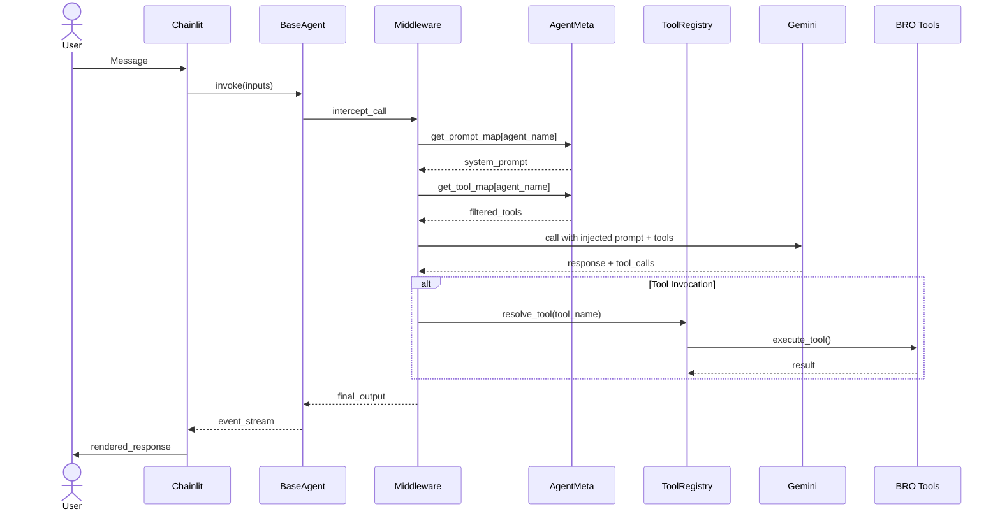

# Agent Invocation Data Flow



## Flow Explanation

### Phase 1: Request Entry
- User submits message in Chainlit UI
- Chainlit invokes the compiled agent graph with `inputs` dict containing:
  - `messages`: conversation history
  - `agent_name`: current agent identifier
  - `session_id`: for workspace isolation

### Phase 2: Middleware Interception
- Before LLM call, middleware reads `agent_name` from request state
- **Middleware looks up agent configuration** from AgentMeta singleton:
  - `prompt_map[agent_name]` → system prompt template
  - `tool_map[agent_name]` → filtered tool set for this agent
- System prompt is injected with safe formatting (uses defaultdict for missing placeholders)
- Tool set is filtered to only include tools assigned to this agent

### Phase 3: LLM Invocation
- Middleware calls `Gemini 2.0 Flash` with:
  - Injected system prompt
  - Filtered tool set
  - Conversation history
  - User message
- LLM returns either:
  - Direct response (no tool calls)
  - Response with tool call requests

### Phase 4: Tool Resolution
- If LLM requested tool calls, middleware resolves each:
  - Looks up tool in ToolRegistry
  - Executes tool with provided arguments
  - Tool execution may:
    - Read/write to workspace files
    - Manage document state
    - Trigger handoff to next agent
    - Return structured results

### Phase 5: Response Generation
- Final output is streamed back to Chainlit
- UIUtils.structured_to_markdown() converts structured data to readable format
- Chainlit streams response to user in real-time

## Key Design Points

### Dynamic Injection
- Same agent graph code works for **all agents** (coordinator, preface_agent, etc.)
- Agent behavior determined by injected prompts and tools
- No conditional logic in agent code
- New agents can be added via `agents.yaml` without code changes

### Tool Filtering
- Full tool pool in ToolRegistry: default + BRO tools
- Each agent only sees tools in its `tool_map`
- Coordinator sees: handoff, document CRUD, status checks
- Specialist agents (preface_agent) see: only format_convert
- Prevents agent confusion and reduces token usage

### State Management
- `agent_name` passed in request dict (routable state)
- `session_id` for workspace isolation
- Document context in `workspace/{session_id}/_doc_context.json`
- No state pollution in agent state dict

### Error Handling
- Tool execution returns Command objects for validation failures
- LLM can retry with error message
- State tools validate transitions before allowing handoff
- Format tools catch LLM extraction errors

## Example: Feature Agent Flow

```
1. User: "Let's define features for the component"
2. Chainlit sets agent_name="features_agent"
3. Middleware injects:
   - Prompt: "You are a feature requirements specialist..."
   - Tools: [format_convert] only
4. LLM: "I'll help you define features. Here are key features..."
   - Calls format_convert(data, output_type="features")
5. Tool returns: structured feature list
6. Middleware renders: markdown with feature table
7. User sees: formatted feature list with UI
8. User can handoff: "Let's move to entities" → agent_name="entity_agent"
```
