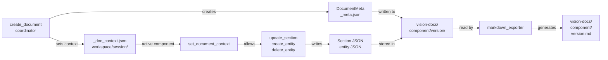

# BRO Document Lifecycle



## Document Structure

### Storage Hierarchy
```
vision-docs/
├── component-a/
│   ├── v1.0/
│   │   ├── _meta.json              # Document metadata
│   │   ├── 01-preface.json         # Section: Preface
│   │   ├── 02-getting-started.json # Section: Getting Started
│   │   ├── 03-01-features.json     # Section: Features
│   │   ├── 05-entity-user.json     # Entity: User
│   │   ├── 05-entity-product.json  # Entity: Product
│   │   └── v1.0.md                 # Exported markdown
│   └── v1.1/
│       └── ...
└── component-b/
    └── ...
```

### File Formats

#### _meta.json (DocumentMeta)
```json
{
  "component": "shopping-cart",
  "version": "1.0",
  "created_at": "2024-01-15T10:30:00Z",
  "updated_at": "2024-01-15T15:45:00Z",
  "sections": {
    "01-preface": {
      "status": "COMPLETE",
      "updated_at": "2024-01-15T11:00:00Z"
    },
    "02-getting-started": {
      "status": "IN_PROGRESS",
      "updated_at": "2024-01-15T14:30:00Z"
    },
    "03-01-features": {
      "status": "DRAFT",
      "updated_at": "2024-01-15T15:00:00Z"
    }
  },
  "dynamic_items": {
    "entities": {
      "user": [
        {"iteration": 1, "created_at": "2024-01-15T12:00:00Z"},
        {"iteration": 2, "created_at": "2024-01-15T14:00:00Z"}
      ],
      "product": [
        {"iteration": 1, "created_at": "2024-01-15T13:00:00Z"}
      ]
    }
  }
}
```

#### Section JSON (e.g., 01-preface.json)
```json
{
  "section_title": "Preface",
  "about_the_guide": "This guide describes the shopping cart system...",
  "intended_audience": "Product managers, developers, designers",
  "business_references": ["Strategic initiative doc", "Customer research"],
  "glossary": {
    "cart": "User's temporary collection of items",
    "checkout": "Process of purchasing items"
  }
}
```

#### Entity JSON (e.g., 05-entity-user.json)
```json
{
  "entity_name": "user",
  "attributes": [
    {
      "name": "user_id",
      "type": "string",
      "description": "Unique identifier"
    }
  ],
  "relationships": [
    {
      "related_entity": "order",
      "relationship_type": "has_many"
    }
  ],
  "business_rules": [
    "Users must have unique email",
    "Password must be 8+ characters"
  ]
}
```

## BRO Tools Flow

### 1. Document Creation
```python
create_document(component="shopping-cart", version="1.0")
```
**Actions:**
- Create DocumentMeta with current timestamp
- Initialize sections dict with all required sections (NOT_STARTED)
- Initialize dynamic_items (entities: {})
- Write _meta.json to vision-docs/shopping-cart/1.0/
- Set session context: workspace/{session_id}/_doc_context.json
```json
{
  "component": "shopping-cart",
  "version": "1.0"
}
```

### 2. Context Management
```python
set_document_context(component="shopping-cart", version="1.0")
```
**Actions:**
- Read existing document from vision-docs/
- Update workspace/{session_id}/_doc_context.json
- All subsequent section/entity operations use this context

### 3. Section Updates
```python
update_section(section_id="01-preface", content={...})
```
**Actions:**
- Read current _doc_context.json
- Get component/version
- Validate section_id exists in sections.yaml
- Write content to vision-docs/{component}/{version}/{section_id}.json
- Update _meta.json: sections[section_id].status = status, timestamp
- Stream markdown representation to UI

### 4. Entity Management
```python
create_entity(entity_name="user")
delete_entity(entity_name="user")
list_entities()
```
**Actions (create):**
- Read current _doc_context.json
- Create new section file: 05-entity-{entity_name}.json
- Initialize with empty attributes, relationships, business_rules
- Update _meta.json: dynamic_items.entities.{entity_name} = [iteration: 1]
- Ready for specialist agent to populate

**Actions (delete):**
- Remove 05-entity-{entity_name}.json file
- Update _meta.json: remove from dynamic_items.entities

### 5. Status Tracking
```python
set_section_status(section_id="01-preface", status="COMPLETE")
```
**Status lifecycle:**
```
NOT_STARTED → IN_PROGRESS → DRAFT/NEEDS_DETAIL → COMPLETE
```

**Tracking:**
- _meta.json.sections[section_id].status
- _meta.json.sections[section_id].updated_at
- Coordinator can query: get_document_status()

### 6. Markdown Export
```python
export_markdown(component="shopping-cart", version="1.0")
```
**Process:**
1. Read DocumentMeta from _meta.json
2. Iterate through sections in order
3. For each section:
   - Read {section_id}.json
   - Format based on section type (preface, features, entities)
   - Append to markdown
4. For entities:
   - Read all 05-entity-*.json files
   - Format each entity section
5. Write to vision-docs/{component}/{version}.md
6. Return markdown string to user

**Output example:**
```markdown
# Shopping Cart - Vision Document v1.0

## Preface
[About the guide content...]

## Getting Started
[Vision and overview...]

## Features
- Feature 1: Add items to cart
- Feature 2: Remove items from cart

## Entities

### User
[User entity details...]

### Product
[Product entity details...]
```

## Session Isolation

### Workspace Directory
```
workspace/
├── session-id-1/
│   ├── _doc_context.json      # Current component/version
│   ├── temp-file-1.txt
│   └── ...
├── session-id-2/
│   ├── _doc_context.json
│   └── ...
```

**Purpose:**
- Each user/session gets isolated workspace
- Document context survives across agent handoffs
- Session cleanup removes old workspaces
- Prevents cross-session data leakage

## Tool Dependencies

```
bro_tools (10 functions)
├── create_document
├── set_document_context
├── get_document_status ─→ DocumentStore.get_document()
├── list_documents ─────→ DocumentStore.list_documents()
├── delete_document ───→ DocumentStore.delete_document()
├── update_section ────→ DocumentStore.write_section()
├── set_section_status → DocumentStore.update_section_status()
├── create_entity ─────→ DocumentStore.create_entity()
├── list_entities ─────→ DocumentStore.list_entities()
├── delete_entity ─────→ DocumentStore.delete_entity()
└── export_markdown ───→ MarkdownExporter.export_document()
```

## Error Handling

| Scenario | Error | Tool Response |
|----------|-------|---------------|
| Document not found | NotFoundError | "Document not found. Create with create_document()" |
| Section doesn't exist | ValidationError | "Invalid section_id. Valid: 01-preface, 02-getting-started, ..." |
| No active context | ContextError | "No active document. Use set_document_context() first" |
| Entity already exists | ConflictError | "Entity already exists. Delete first with delete_entity()" |
| Invalid status | ValidationError | "Invalid status. Valid: NOT_STARTED, IN_PROGRESS, DRAFT, COMPLETE" |

## Integration with Agents

### Coordinator Flow
1. User: "Create a new vision doc for payment system"
2. Coordinator calls: create_document("payment-system", "1.0")
3. Context automatically set
4. Coordinator offers: "What section would you like to start with?"

### Specialist Agent Flow
1. User: "Let's define the preface"
2. Coordinator calls: handoff(next_agent="preface_agent")
3. Preface agent receives: session_id (workspace context preserved)
4. Preface agent calls: update_section("01-preface", content)
5. Status auto-updated: "01-preface" → IN_PROGRESS
6. Preface agent calls: set_section_status("01-preface", "COMPLETE")

### Entity Creation Flow
1. User: "Add a user entity"
2. Coordinator calls: create_entity("user")
3. Coordinator calls: handoff(next_agent="entity_agent", entity_name="user")
4. Entity agent populates: 05-entity-user.json
5. Coordinator can: create_entity("product"), handoff to entity_agent again

## Markdown Export Timing

**When to export:**
- User requests: "Export this as markdown"
- After section completion
- Before document versioning

**Export includes:**
- All completed sections
- All drafted sections
- All entities (created or completed)
- Glossary and references from preface
- Proper markdown formatting

**Output sent to:**
- Returned to user in chat
- Optionally saved to vision-docs/{component}/{version}.md
- Can be copied to external documentation systems
