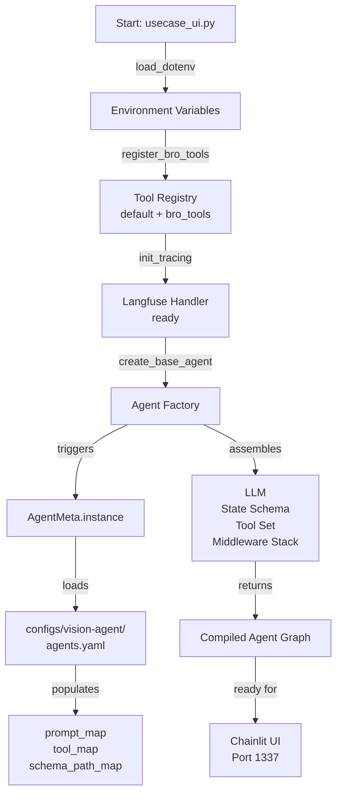

# Configuration Initialization Order



## Startup Sequence (Critical Order)

### Step 1: Environment Loading
```python
# .env variables loaded
GOOGLE_API_KEY=...
LANGFUSE_PUBLIC_KEY=...
LANGFUSE_SECRET_KEY=...
```

### Step 2: Tool Registration (BEFORE Agent Creation)
```python
register_bro_tools()
```
**Why this order matters:**
- BRO tools must be in registry before `AgentMeta.instance()` is called
- `AgentMeta` loads `agents.yaml` and filters tools from registry
- If tools not registered, `tool_map` will be incomplete
- Agent would be missing tools it's supposed to use

**Registration details:**
- Default tools always present: handoff, get_agent_list, read_file, write_file, convert_format
- BRO tools added: create_document, set_document_context, get_document_status, etc.
- Tool pool stored in module-level list in tool_registry.py

### Step 3: Observability Initialization
```python
init_tracing()
```
**Langfuse handler prepared:**
- Reads LANGFUSE_* env vars
- Creates callback handler for LangChain
- Handler attached to agent during creation

### Step 4: Agent Creation
```python
create_base_agent()
```
**This is where the magic happens:**

a) **First invocation**: `AgentMeta.instance()` loads configuration
   - Reads `configs/vision-agent/agents.yaml`
   - Parses prompt files from `prompts/` directory
   - Populates `prompt_map`, `tool_map`, `schema_path_map`
   - Cached for subsequent invocations

b) **Agent assembly**:
   - LLM factory called: `lm()` → returns Gemini instance
   - State schema created: `Dynagent` class
   - Tool registry queried: `get_all_tools()` → default + registered tools
   - Middleware stack configured:
     - `inject_agent_async/inject_agent_sync` - Dynamic injection
     - `SummarizationMiddleware` - Message compression

c) **Graph compilation**:
   - LangGraph state machine created
   - Nodes: model (LLM), tools
   - Checkpointer attached (thread_id routing)
   - Returns compiled, invocable graph

### Step 5: UI Ready
```python
# Chainlit listens on port 1337
uvicorn app on 0.0.0.0:1337
```

## Agent Configuration Files

### agents.yaml Structure
```yaml
coordinator:
  prompt_path: prompts/coordinator.md
  tools: [handoff, create_document, set_document_context, ...]
  approach: "orchestration"

preface_agent:
  prompt_path: prompts/01-preface.md
  tools: [convert_format]
  output_schema: vision-agent/01-preface.json
  approach: "qa"

# ... other agents
```

### Key Files Loaded at Startup
- `configs/vision-agent/agents.yaml` - Agent definitions
- `prompts/*/**.md` - Prompt templates (lazy loaded per agent)
- `configs/vision-agent/output-schemas/**.json` - Structured output schemas
- `configs/vision-agent/sections.yaml` - Document section structure (optional)

## Lazy Initialization Details

### AgentMeta Singleton
```python
# First call to AgentMeta.instance()
# - Loads agents.yaml
# - Caches configuration in memory
#
# Subsequent calls
# - Return cached instance (no file I/O)
#
# Testing
# - AgentMeta.reset() clears singleton for test isolation
```

### Prompt Loading
```python
# Prompts loaded by agent_config_reader()
# - Reads from prompts/{agent_id}.md
# - Stored in prompt_map[agent_id]
# - Lazy: only loaded when agent first invoked
```

## Validation Points

### Pre-Agent-Creation Checks
- Google API key must be set (GOOGLE_API_KEY env var)
- agents.yaml must exist and be valid YAML
- All prompt files referenced in agents.yaml must exist
- All output schema files must exist (if agent uses structured output)

### Post-Agent-Creation Checks
- Agent graph is compiled and ready to invoke
- AgentMeta.instance() successfully cached
- All tools accessible from tool_registry
- Langfuse handler (if enabled) is attached

## Failure Scenarios

| Scenario | Error | Fix |
|----------|-------|-----|
| Missing GOOGLE_API_KEY | AuthenticationError | Set env var |
| agents.yaml not found | FileNotFoundError | Verify config path |
| Prompt file missing | FileNotFoundError | Add prompt markdown |
| Tool not in registry | ToolNotFoundError | Call register_bro_tools() first |
| Invalid YAML syntax | YAMLError | Fix agents.yaml syntax |
| Output schema mismatch | ValidationError | Verify schema JSON |

## Environment Variables Required

```bash
# Required
GOOGLE_API_KEY=<your-google-gemini-key>

# Optional (for observability)
LANGFUSE_PUBLIC_KEY=<key>
LANGFUSE_SECRET_KEY=<key>
LANGFUSE_HOST=https://cloud.langfuse.com

# Optional (for OAuth)
GITHUB_CLIENT_ID=<id>
GITHUB_CLIENT_SECRET=<secret>

# Optional (for debugging)
DEBUG=true
```
