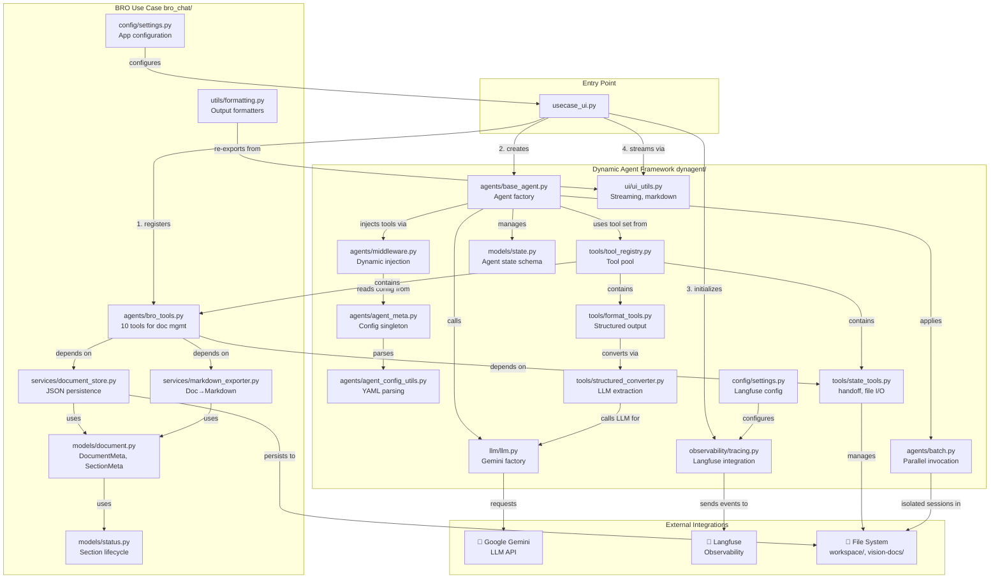

# Detailed Module Dependencies Diagram

## Module Organization

### BRO Use Case Layer (`src/bro_chat/`)
- **agents/bro_tools.py** - 10 tools for document management and entity creation
- **services/document_store.py** - File-based JSON persistence
- **services/markdown_exporter.py** - Converts vision documents to markdown
- **models/document.py** - DocumentMeta, SectionMeta, DynamicItems
- **models/status.py** - Section lifecycle states
- **utils/formatting.py** - Output formatting for different sections
- **config/settings.py** - Application configuration (API keys, OAuth, ports)

### Generic Agent Framework (`src/dynagent/`)
- **agents/base_agent.py** - Creates compiled LangGraph agent
- **agents/middleware.py** - Dynamic prompt/tool injection per agent
- **agents/agent_meta.py** - Configuration singleton (YAML-based)
- **agents/agent_config_utils.py** - YAML parser for agent definitions
- **tools/tool_registry.py** - Centralized tool pool (default + use-case tools)
- **tools/state_tools.py** - handoff, file I/O, document management
- **tools/format_tools.py** - Structured output conversion
- **tools/structured_converter.py** - LLM-based data extraction
- **llm/llm.py** - Gemini factory singleton
- **models/state.py** - Agent state schema (agent_name, session_id routing)
- **agents/batch.py** - Batch processing interface for parallel invocation
- **observability/tracing.py** - Langfuse integration
- **config/settings.py** - Langfuse configuration
- **ui/ui_utils.py** - Streaming utilities and markdown rendering

### Key Dependency Patterns
1. **No circular imports** - dynagent never imports bro_chat
2. **Singleton configs** - AgentMeta loaded once at startup
3. **Tool registration** - BRO tools registered before agent creation
4. **Lazy initialization** - AgentMeta instance created on first agent use
5. **Session isolation** - Workspace directories per session_id
